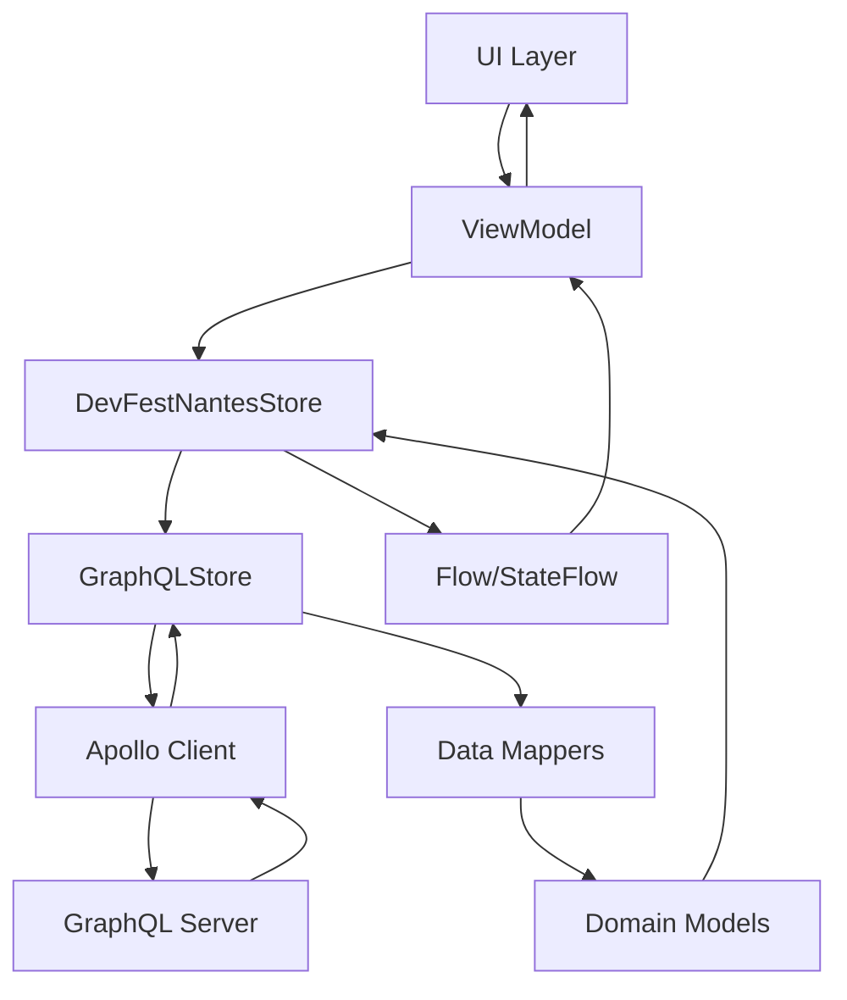

# DevFest Nantes - Architecture Guide

This document provides a comprehensive overview of the DevFest Nantes mobile application architecture, built using Kotlin Multiplatform Mobile (KMM).

## Table of Contents

- [Overview](#overview)
- [Module Architecture](#module-architecture)
- [Data Flow](#data-flow)
- [Platform-Specific Implementation](#platform-specific-implementation)
- [Design Patterns](#design-patterns)
- [Key Components](#key-components)
- [Architecture Decisions](#architecture-decisions)

## Overview

The DevFest Nantes app follows a **Clean Architecture** approach with **Kotlin Multiplatform Mobile (KMM)** to maximize code sharing between Android and iOS while maintaining platform-specific optimizations.

```
┌─────────────────────────────────────────────────────────────┐
│                    Presentation Layer                       │
│  ┌─────────────────────┐    ┌─────────────────────────────┐ │
│  │     Android App     │    │        iOS App             │ │
│  │   (Jetpack Compose) │    │      (SwiftUI)             │ │
│  └─────────────────────┘    └─────────────────────────────┘ │
└─────────────────────────────────────────────────────────────┘
┌─────────────────────────────────────────────────────────────┐
│                     Domain Layer                            │
│              Shared Business Logic (Kotlin)                │
│   ┌─────────────┐  ┌─────────────┐  ┌─────────────────┐   │
│   │ Use Cases   │  │ Repositories│  │   Models        │   │
│   └─────────────┘  └─────────────┘  └─────────────────┘   │
└─────────────────────────────────────────────────────────────┘
┌─────────────────────────────────────────────────────────────┐
│                     Data Layer                              │
│              Shared Data Access (Kotlin)                   │
│   ┌─────────────┐  ┌─────────────┐  ┌─────────────────┐   │
│   │GraphQL Store│  │  Local Cache│  │   Data Models   │   │
│   └─────────────┘  └─────────────┘  └─────────────────┘   │
└─────────────────────────────────────────────────────────────┘
```

## Module Architecture

### 1. `shared/` Module

The core of the application containing all shared business logic.

```
shared/
├── src/
│   ├── commonMain/kotlin/
│   │   ├── com/gdgnantes/devfest/
│   │   │   ├── model/           # Data models and entities
│   │   │   ├── store/           # Data access layer
│   │   │   │   ├── graphql/     # GraphQL implementation
│   │   │   │   └── DevFestNantesStore.kt
│   │   │   └── analytics/       # Analytics abstractions
│   │   └── build.gradle.kts
│   ├── androidMain/kotlin/      # Android-specific implementations
│   ├── iosMain/kotlin/          # iOS-specific implementations
│   └── commonTest/kotlin/       # Shared tests
```

**Key Responsibilities:**
- Data models and business entities
- GraphQL API client and data fetching
- Business logic and use cases
- Platform-agnostic analytics interfaces
- Mock implementations for testing

### 2. `shared-ui/` Module (Experimental)

Contains shared UI components and resources (currently experimental).

**Purpose:**
- Shared design tokens and themes
- Common UI components
- Resource management

### 3. `androidApp/` Module

Android-specific implementation using modern Android development practices.

```
androidApp/
├── src/main/java/com/gdgnantes/devfest/androidapp/
│   ├── core/                    # Core Android components
│   │   ├── injection/           # Dagger Hilt modules
│   │   └── ApplicationInitializer.kt
│   ├── ui/                      # UI layer
│   │   ├── components/          # Reusable Compose components
│   │   ├── screens/             # Feature screens
│   │   │   ├── agenda/          # Agenda feature
│   │   │   ├── speakers/        # Speakers feature
│   │   │   ├── session/         # Session details
│   │   │   └── venue/           # Venue information
│   │   └── theme/               # Material Design theme
│   ├── services/                # Platform services
│   └── utils/                   # Android utilities
```

**Technology Stack:**
- **UI Framework:** Jetpack Compose
- **Dependency Injection:** Dagger Hilt
- **Navigation:** Navigation Component
- **Architecture:** MVVM with StateFlow
- **Design System:** Material 3

### 4. `iosApp/` Module

iOS-specific implementation using SwiftUI and modern iOS patterns.

```
iosApp/
├── iosApp/
│   ├── UI/                      # SwiftUI views and view models
│   │   ├── Speakers/            # Speaker-related views
│   │   ├── Agenda/              # Agenda views
│   │   └── About/               # About and settings
│   ├── Model/                   # iOS-specific models and extensions
│   │   ├── BaseViewModel.swift  # Base view model class
│   │   └── Data/                # Data transformation helpers
│   ├── Extension/               # Swift extensions
│   ├── Analytics/               # iOS analytics implementation
│   └── Resources/               # iOS resources and assets
```

**Technology Stack:**
- **UI Framework:** SwiftUI
- **Minimum iOS Version:** 15.0
- **Dependency Management:** Swift Package Manager
- **Architecture:** MVVM with Combine
- **Async Handling:** KMP-NativeCoroutines

## Data Flow

### 1. Data Fetching Flow



### 2. State Management

#### Android (StateFlow)
```kotlin
@HiltViewModel
class AgendaViewModel @Inject constructor(
    private val store: DevFestNantesStore
) : ViewModel() {
    
    private val _uiState = MutableStateFlow(UiState.LOADING)
    val uiState: StateFlow<UiState> = _uiState.asStateFlow()
    
    val agenda = store.agenda
        .stateIn(
            scope = viewModelScope,
            started = SharingStarted.WhileSubscribed(5000),
            initialValue = null
        )
}
```

#### iOS (Combine + KMP-NativeCoroutines)
```swift
@MainActor
class AgendaViewModel: BaseViewModel {
    @Published var agendaContent: AgendaContent = AgendaContent(sections: [])
    @Published var isLoading = true
    
    func observeAgenda() async {
        do {
            let agendaSequence = asyncSequence(for: store.agenda)
            for try await agenda in agendaSequence {
                // Update UI state
            }
        } catch {
            // Handle error
        }
    }
}
```

### 3. Caching Strategy

The app implements a multi-layer caching strategy:

1. **Apollo Cache:** GraphQL response caching
2. **Memory Cache:** In-memory data storage
3. **Disk Cache:** Persistent local storage (future enhancement)

## Platform-Specific Implementation

### Android Specifics

#### Dependency Injection (Hilt)
```kotlin
@Module
@InstallIn(SingletonComponent::class)
abstract class AppModule {
    @AppScope
    @Provides
    fun store(): DevFestNantesStore {
        return DevFestNantesStoreBuilder()
            .setUseMockServer(false)
            .build()
    }
}
```

#### Compose UI Pattern
```kotlin
@Composable
fun SessionLayout(
    viewModel: SessionViewModel,
    onBackClick: () -> Unit
) {
    val sessionState = viewModel.session.collectAsState()
    
    when (val state = sessionState.value) {
        is UiState.Loading -> LoadingLayout()
        is UiState.Success -> SessionContent(state.data)
        is UiState.Error -> ErrorLayout(state.exception)
    }
}
```

### iOS Specifics

#### Store Integration
```swift
class BaseViewModel: ObservableObject {
    let store: DevFestNantesStore
    
    init() {
        self.store = DevFestNantesStoreBuilder()
            .setUseMockServer(useMockServer: false)
            .build()
    }
}
```

#### SwiftUI View Pattern
```swift
struct SessionView: View {
    @ObservedObject var viewModel: SessionViewModel
    
    var body: some View {
        LoadingView(isShowing: $viewModel.isLoading) {
            if let session = viewModel.session {
                SessionContent(session: session)
            }
        }
    }
}
```

## Design Patterns

### 1. Repository Pattern

The `DevFestNantesStore` interface abstracts data access:

```kotlin
interface DevFestNantesStore {
    val agenda: Flow<Agenda>
    val sessions: Flow<List<Session>>
    val speakers: Flow<List<Speaker>>
    
    suspend fun getSession(id: String): Session?
    suspend fun getSpeaker(id: String): Speaker?
}
```

### 2. Builder Pattern

Store configuration uses the builder pattern:

```kotlin
class DevFestNantesStoreBuilder {
    fun setUseMockServer(useMockServer: Boolean): DevFestNantesStoreBuilder
    fun build(): DevFestNantesStore
}
```

### 3. Factory Pattern

Platform-specific implementations are created using factories:

```kotlin
// Android
@Provides
fun store(): DevFestNantesStore = DevFestNantesStoreBuilder().build()

// iOS
let store = DevFestNantesStoreBuilder().build()
```

### 4. Observer Pattern

Data flow uses reactive streams:
- **Android:** StateFlow/Flow
- **iOS:** Combine Publishers with KMP-NativeCoroutines

## Key Components

### 1. Data Models

Core domain models are defined in the shared module:

```kotlin
data class Session(
    val id: String,
    val title: String,
    val abstract: String,
    val speakers: List<Speaker>,
    val room: Room?,
    val scheduleSlot: ScheduleSlot,
    val category: Category?,
    val language: SessionLanguage?,
    val complexity: Complexity?
)
```

### 2. GraphQL Integration

Apollo client with type-safe queries:

```kotlin
class GraphQLStore(private val apolloClient: ApolloClient) : DevFestNantesStore {
    override val sessions: Flow<List<Session>> =
        apolloClient.query(GetSessionsQuery())
            .toFlow()
            .map { response -> 
                response.data?.sessions?.map { it.toSession() } ?: emptyList()
            }
}
```

### 3. Mappers

Data transformation between GraphQL and domain models:

```kotlin
fun SessionDetails.toSession(): Session {
    return Session(
        id = id,
        title = title,
        abstract = description ?: "",
        speakers = speakers.map { it.speakerDetails.toSpeaker() },
        room = rooms.firstOrNull()?.roomDetails?.toRoom(),
        scheduleSlot = ScheduleSlot(
            startDate = startsAt.toIso8601Z(),
            endDate = endsAt.toIso8601Z()
        )
    )
}
```

## Architecture Decisions

### 1. Why Kotlin Multiplatform?

**Decision:** Use KMM for sharing business logic
**Rationale:**
- Reduces code duplication
- Ensures consistent business logic across platforms
- Leverages existing Kotlin expertise
- Maintains platform-specific UI flexibility

### 2. Why GraphQL?

**Decision:** Use GraphQL with Apollo client
**Rationale:**
- Type-safe API integration
- Efficient data fetching
- Built-in caching capabilities
- Excellent tooling support

### 3. Why Clean Architecture?

**Decision:** Implement Clean Architecture principles
**Rationale:**
- Clear separation of concerns
- Testable business logic
- Platform independence
- Maintainable codebase

### 4. UI Framework Choices

**Android - Jetpack Compose:**
- Modern declarative UI
- Excellent performance
- Strong community support

**iOS - SwiftUI:**
- Native iOS experience
- Declarative UI consistency
- Future-proof technology

### 5. State Management

**Decision:** Use reactive streams for state management
**Rationale:**
- Unidirectional data flow
- Predictable state updates
- Excellent testing support
- Platform-appropriate patterns

## Future Considerations

### Planned Improvements

1. **Offline-First Architecture:** Enhanced local caching
2. **Shared UI Components:** Expand shared-ui module
3. **Error Handling:** Standardized error handling patterns
4. **Performance Optimization:** Data loading optimizations
5. **Testing Strategy:** Comprehensive test coverage

### Migration Considerations

- Gradual migration to Compose Multiplatform when stable
- Enhanced shared business logic
- Improved platform abstraction layers

---

This architecture provides a solid foundation for the DevFest Nantes app while maintaining flexibility for future enhancements and platform-specific optimizations.
